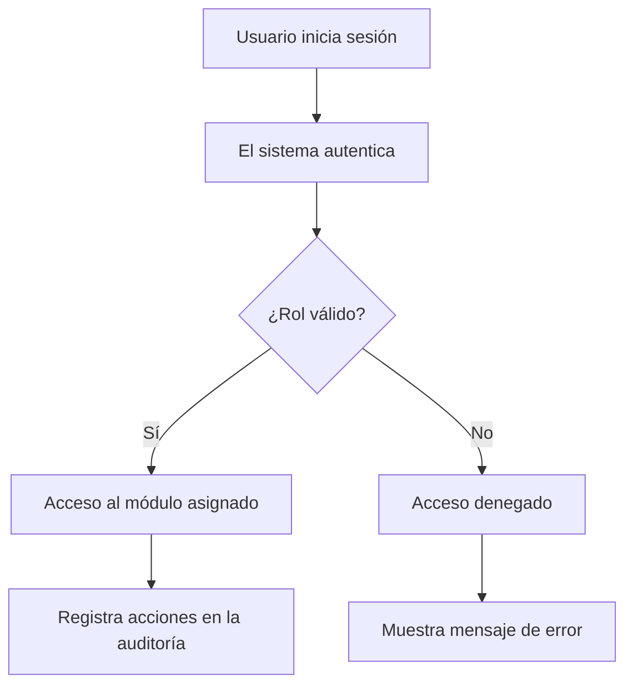

# SISTEMA-TDR

## Cómo funciona
El SISTEMA-TDR gestiona registros y documentación técnica en un entorno seguro. Funciona con autenticación basada en roles que permite permisos específicos:

## Equipo / Autor
Este proyecto ha sido diseñado y desarrollado por el Equipo SISTEMA-TDR con el propósito de mejorar la gestión y trazabilidad de datos técnicos.

### Contacto:
- Nombre: Juan Pérez
- Email: juan.perez@example.com

### Contribución
Si deseas colaborar, revisa las issues abiertas o envía un Pull Request.
